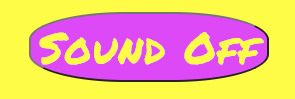

# Kidz Memo

Visit the deployed site here: [Kidz Memo](https://reltoom.github.io/Memo/)

This site is a memory game for kids. It has bright, fun colors and the memory 'cards' are drawn by a child. There are 2 game difficulties, easy and hard. On easy, the player needs to match 4 pairs of cards and on hard, the player needs to match 8 pair of cards.

## CONTENTS

* [User Experience](#user-experience-ux)
  * [User Stories](#user-stories)
  * [Design](#design)
    * [Colour Scheme](#colour-scheme)
    * [Typography](#typography)
    * [Future Implementations](#future-implementations)
* [Features](#features)
    * [The Home Page](#the-home-page)
    * [The Yoga Page](#the-yoga-page)
    * [The Watsu Page](#the-watsu-page)
    * [The Newsletter-Sign Up Page](#the-newsletter-sign-up-page)
    * [The Thank You Page](#the-thank-you-page)
* [Technologies](#technologies)
  * [Languages](#languages)
  * [Websites & Programs](#websites-programs)
* [Deployment](#deployment)
* [Testing](#testing)
   * [Validator Test](#validator-test)
   * [Bugs](#bugs)
* [Credits](#credits)
  * [Code Used](#code-used)
  * [Media](#media)
  * [Acknowledgments](#acknowledgments)

- - -
## User Experience (UX)

### User Stories

#### First Time Visitor Goals

* Easy to understand what game you will play and how.
* Easy to navigate and start a game.
* Easy to reset the game after winning.

#### Returning Visitor Goals

* Layout is the same as before.
* Trying to beat the game modes faster than before.

## Design

Using the images of my daughters drawings for the game was a deliberate style choice. Each of her pictures had different dimensions(width and heigth) so it was very difficult to adjust the images so they would be centered and show full image. I could have chosen a more fluid or easier to crop image, but I thought having a child's drawing as the art for Kidz Memo would add layer of excitment and wonder for kids. Maybe they could get their drawings into the game?
### Color Scheme

I wanted the color scheme to happy, fun and bright. Something to draw a kids attention to it.
* `Rgba(234, 213, 255, 1)`A light lavender type is used as the primary background color the whole site.
* `Rgba(221, 72, 247, 1)`A shade of purple is used for Links, headers, text for reset button and background for Sound On/Off button.
* `Rgba(254, 252, 71, 1)`A shade of dark yellow is used for the main header background and main text background. It is also the background of the reset button and the text of the Sound On/Off button.
* `Rgba(5, 43, 237, 1)`A shade of royal blue is used for the name of the site, Kidz Memo, and then the text for rules and game modes.

  

### Typography

One type of font from Google Fonts was used for this site.

* For text, Kidz Memo uses [Permanent Marker](https://fonts.google.com/specimen/Permanent+Marker). This seemed like a fun 'marker' style that a kid could use. 

### Future Implementations

1. Add a moves counter to see how many 'turns' it takes to win.
2. Adding a timer to see how long it takes to win a game.
3. Different pictures for the 'cards' and even bigger game area.
4. Get kids to send in their own drawings for Kidz Memo art.

- - -

## Features

Kidz Memo has a 'home' page, 'easy mode' page and 'hard mode' page.

The whole site is responsive and works just as well on mobile phones as desktop screens.

* The word 'Memo'is writen in font-style and color scheme used for the site as the favicon.

  

* The Header section includes the title: 'Kidz Memo' as well as links to the game modes  and Sound On/Off button.
    
    

* The Main area holds the rules, descriptions of game modes and the game areas.

* When a player complete a game by matching all the pairs, a win message will pop up. This can be closed by clicking anywhere on the message.

#### The Home Page

The home page of 'Kidz Memo' has the main header and then game rules and descriptions.

#### The Easy Mode

The header in this game mode holds links to the home page as well as the other game mode. It also has the Sound On/Off button.

The Easy Mode version of the game is a 3 by 3 square. It includes one extra piece as 4 pairs is 8 blocks, so the 9th block is to fill the grid, it is unclickable.

There is a 'reset' button at the bottom of the page to play again or to just reset the game board if you want.

#### The Hard Mode

The header in this game mode holds links to the home page as well as the other game mode. It also has the Sound On/Off button.

The Hard Mode version of the game is a 4 by 4 square. It has 8 pairs for a total of 16 blocks.

There is a 'reset' button at the bottom of the page to play again or to just reset the game board if you want.

- - -

## Technologies 

### Languages 

HTML, CSS & Javascript were used in the making of Kidz Memo.

###  Websites & Programs 

* [Balsamiq](https://balsamiq.com/) - Created wireframes for basic outline and structure of site.
* [Github](https://github.com/) - Created repository and stored files here after commits.
* [Microsoft Visual Studio](https://visualstudio.microsoft.com/) - Wrote code and did commits to Github from here.
* [Google Fonts](https://fonts.google.com/) - Imported font for Kidz Memo.
* [Google Developer Tools](https://developer.chrome.com/docs/devtools) - For viewing in different screen resolutions and finding errors.
* [TinyPNG](https://tinypng.com/) Compressed images for better performance.
* [Favicon.io](https://favicon.io/) Created the 'Memo' favicon for the webbrowser.
* [W3 School](https://www.w3schools.com/) Read and used as a guide for some code.
* [UI.dev Am I Responsive](https://ui.dev/amiresponsive) Used to get image of all different devices.

- - -

## Deployment 

Kidz Memo is deployed from Github Pages - [Kidz Memo](https://reltoom.github.io/Memo/).

To Deploy the site from GitHub Pages:

1. Go to the repository for this project and choose 'Settings'
2. From left side selection, go to 'Pages'.
3. Under 'Build and Deployment' from Source - choose 'Deploy from a branch'.
4. Under 'Branch', choose 'Main' from the first dropdown menu.
5. From the second dropdown menu, with the image of a folder, choose 'root', then save.

#### How to Fork

If you want to fork this repository:

1. Go to the repository for this project, [Kidz Memo](https://github.com/reltoom/Memo).
2. In the upper right hand area of the screen, click the 'Fork' button.
3. Then when the menu drops down, click 'Create New Fork'. (If you are the owner of a repository, you cannot fork.) 

#### How to Clone

If you want to clone this repository:

1. Go to the repository for this project [Kidz Memo](https://github.com/reltoom/Memo).
3. Click on the green 'Code' button and then select how you would like to clone: HTTPS, SSH or GitHub CLI (under the 'local' tab). 
4. Either copy the desired code or click to open with another program from the list below the code.
4. Open your code editor and go to 'Clone Repository' usually under 'File'.
5. Paste if your code and then 'Clone'.

- - -

## Testing

Kidz Memo has been tested on: Chrome, Microsoft Edge and Safari(Reset button does not cover full bottom of page).

With Dev Tools all standard screen sizes were tested to make sure the site looks good and is still readable. 

I had a couple of friends, my brothers, and my daughter test the game and check user error possiblities.

Links in the main menu take the user to correct game modes. Sound On/Off works correctly. Reset Button works correctly by reshuffling the whole game board.

Win message pops up on player completion of a game mode and can be closed.

## Validator Test

* HTML
    * Using the [W3C Validator](https://validator.w3.org/#validate_by_input), code was checked for each webpage of Kidz Memo to see if there were any errors. There were no errors.
    
* CSS
    * Using the [W3C Validator](https://jigsaw.w3.org/css-validator/) the code for CSS was checked for errors, there were none.
    
* Javascript
    * Using the [JShint Validator](https://jshint.com/) we analyzed the Javascript code. There are no errors but 17 warnings, most of which are :'let' is available in ES6 (use 'esversion: 6') or Mozilla JS extensions (use moz).
* Accessibility 
    * Using the Lighthouse dev tool from Chrome; accessibitly, performace, best practices and SEO were tested for each page.
    

### Bugs

Here are some, but not all, of the bugs that were fixed during development. 

| Bug | Fix |
| :--- | :--- |
| Boxes for the game areas not aligning properly | Commented out lines of CSS code and reapplied them one by one. |
| Sound Button not working | Googled javascript code for muting, read several sites and put it into code. Trial and error until it worked. |
| Not being able to close the pop up win message | Googled ways to close a modal pop up and tested several varients.
| Boxes not flipping when clicked | Doubled checked CSS and javascript function to make sure right elements were selected for flipping|

There was alot of back and forth with the writing of several lines of code, saving, running and re-writing. For some functions to work, all 3 elements had to be right, HTML, CSS and Javascript. Rereading course material and Googling that same material to better grasp the concepts was needed. 

There are no unsolved errors.

- - -

## Credits

### Code Used

Most of the code I wrote myself with a lot of trial and error, saving and viewing on web browser. 

For the structure of the functions for the game I followed [Paddy Walshes Project](https://github.com/paddyw11/Paddy-walsh-project-2b).

For the modal pop up I followed code from [W3School](https://www.w3schools.com/howto/howto_css_modals.asp).

Structure for the README file is from my project [Ways to Relax](https://github.com/reltoom/Project-1-Relax) adjusted to fit Kidz Memo.

### Media

Audio clip is from [Free Sound](https://freesound.org/).

Images for the Memo game are drawn by my daughter.

### Acknowledgments
Thank you to my daughter and wife for helping support me through my studies.

Thank you to the Swedish Slack channel for keeping my spirits high.

Thank you to my mentor from CI, Precious, for giving me advice and guidelines on the project.